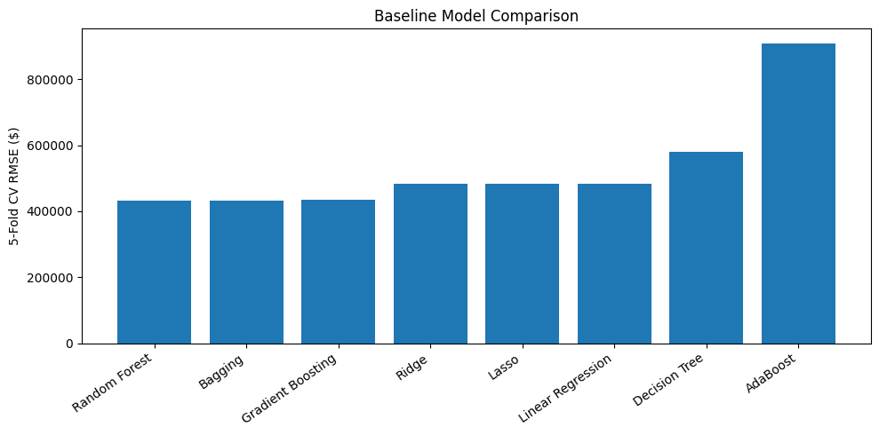
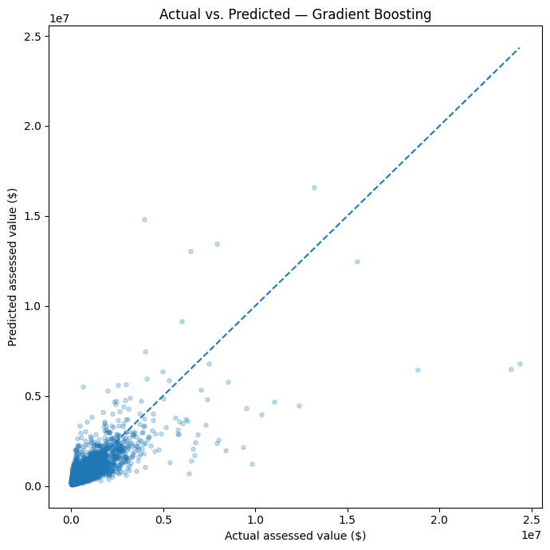
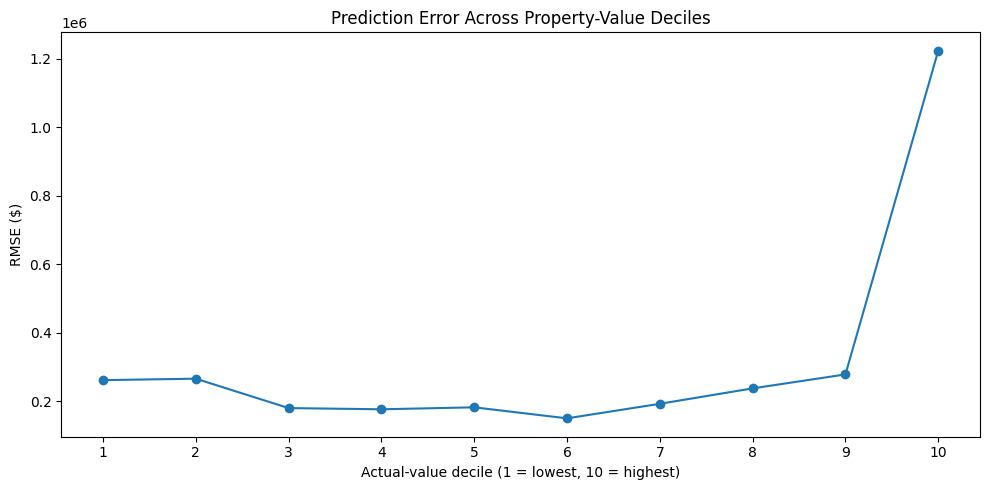
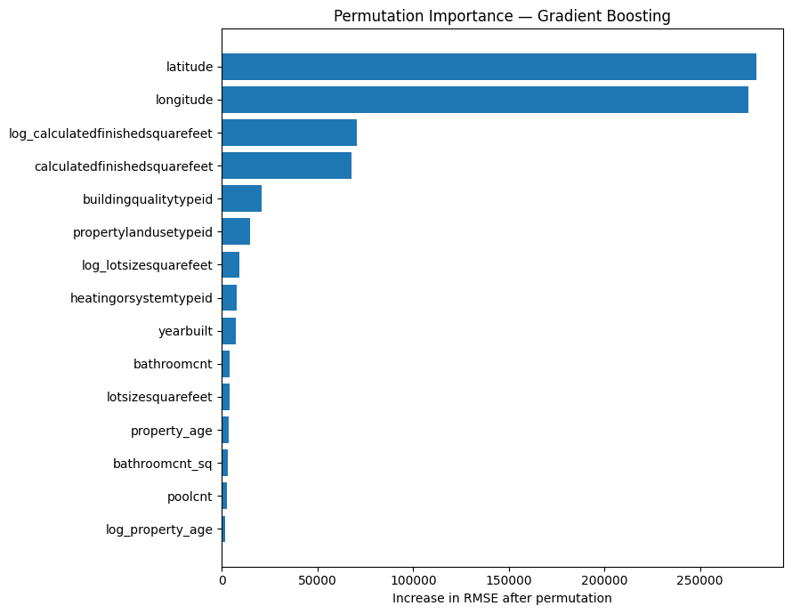

# Zillow Assessed Property Value Prediction

A machine learning regression project that predicts Zillow tax-assessed property values using property characteristics such as location, finished square footage, building quality, property type, bedrooms, bathrooms, lot size, and property age.

I used this project to build a complete modeling workflow from data cleaning and feature engineering through model comparison, hyperparameter tuning, held-out evaluation, error analysis, and feature importance.

## Results

The final selected model was **Gradient Boosting**.

| Metric | Result |
|---|---:|
| Development CV RMSE | $429,443 |
| Test RMSE | $438,823 |
| Test MAE | $195,897 |
| Test R² | 0.557 |

The cross-validation and test RMSE were fairly close, which suggests the test performance was consistent with what I observed during model development. The largest errors came from very high-value properties.

## Project Highlights

- Worked with **77,613 raw property records**
- Retained **77,380 observations** for modeling after cleaning
- Used an **80/20 train-test split**
- Built leakage-safe preprocessing with `Pipeline` and `ColumnTransformer`
- Engineered property age, log transforms, ratios, interaction terms, and nonlinear features
- Compared **8 regression models** using cross-validation
- Tuned Gradient Boosting, Random Forest, and Ridge
- Evaluated the selected model once on a held-out test set
- Analyzed residuals and prediction error across property-value ranges
- Used permutation importance to interpret the final model

## Modeling Workflow

1. Load and review the Zillow dataset
2. Clean the target and remove duplicates
3. Split into training and test sets before fitting preprocessing
4. Learn missingness rules from training data only
5. Engineer additional property features
6. Build numeric and categorical preprocessing pipelines
7. Compare baseline regression models with 5-fold cross-validation
8. Tune the strongest model families
9. Select the final model using training-set cross-validation
10. Evaluate on the untouched test set
11. Analyze residuals, value-range errors, and feature importance

## Model Comparison



The baseline comparison included Linear Regression, Ridge, Lasso, Decision Tree, Bagging, Random Forest, AdaBoost, and Gradient Boosting.

## Final Model Performance



The final Gradient Boosting model achieved an R² of **0.557** on the held-out test set. It captured meaningful variation in assessed property values, but prediction quality weakened for the most expensive properties.

## Error Analysis



Error analysis showed that extreme-value properties contributed disproportionately to overall RMSE. This also helps explain why RMSE was much larger than MAE.

## Feature Importance



Location, finished square footage, building quality, and property type were among the most useful predictors in the final model.

## Tools and Libraries

- Python
- pandas
- NumPy
- matplotlib
- scikit-learn
- Jupyter Notebook

### Machine Learning Techniques

- Regression
- Feature engineering
- Missing-value imputation
- One-hot encoding
- Standardization
- Cross-validation
- Grid search
- Randomized search
- Validation curves
- Residual analysis
- Permutation importance

## Repository Structure

```text
zillow-assessed-value-portfolio/
├── Zillow_Assessed_Value_Prediction.ipynb
├── README.md
├── requirements.txt
├── .gitignore
├── data/
│   └── README.md
└── images/
    ├── baseline_model_comparison.png
    ├── actual_vs_predicted.png
    ├── error_by_value_decile.png
    └── feature_importance.png
```

## How to Run

Clone the repository and install the dependencies:

```bash
pip install -r requirements.txt
```

Then open:

```text
Zillow_Assessed_Value_Prediction.ipynb
```

The notebook downloads the dataset automatically if the CSV is not already available locally.

## Dataset

The notebook uses the 2016 Zillow property dataset available from the Boston University-hosted course data source referenced directly in the notebook.

The raw CSV is intentionally not included in this repository.

## Limitations

The dataset does not contain every factor that may influence property value. Renovation quality, interior condition, neighborhood amenities, views, recent comparable sales, and other local market information could improve prediction quality.

The dataset is from 2016, so this project should be treated as a machine learning portfolio analysis rather than a current property valuation system.

## Future Work

Possible extensions include:

- Testing XGBoost or LightGBM
- Adding richer neighborhood and geographic features
- Comparing the current target with a log-transformed target
- Exploring approaches specifically designed for high-value properties

